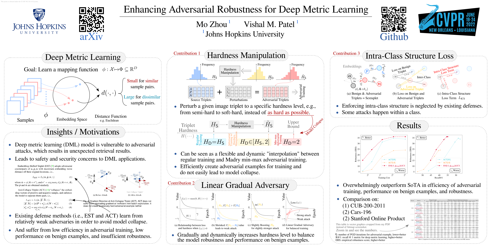

Robust Deep Metric Learning (RobDML)
===

**Paper:** Mo Zhou, Vishal M. Patel, *Enhancing Adversarial Robustness for Deep Metric Learning*, CVPR, 2022  
**PDF:** <a href="https://arxiv.org/abs/2203.01439" target="_blank"></a> [[OpenAccess]](https://openaccess.thecvf.com/content/CVPR2022/html/Zhou_Enhancing_Adversarial_Robustness_for_Deep_Metric_Learning_CVPR_2022_paper.html)  
**Code:** https://github.com/cdluminate/robrank  
**Poster:** [[PDF Version]](slides/poster.pdf) [[SVG Source]](slides/poster.svg) [[PNG Version]](slides/poster.png)   
**Slides:** [[Full-length Presentation Version]](slides/slides.pdf) [[Single-page Version]](slides/slides-singlepage.pdf)  
**Video:** [[Bilibili (English)]](https://www.bilibili.com/video/BV1Y34y1j7g4) [[YouTube (English)]](https://www.youtube.com/watch?v=IQLvG0wjB-I) [[Bilibili (Chinese)]](https://www.bilibili.com/video/BV1GY4y1z7No/) [[YouTube (Chinese)]](https://www.youtube.com/watch?v=ATqDBZIpZwQ)  



## "Brief" code usage instructions:

Our code is based on the public code of the following paper:
["Adversarial Attack and Defense in Deep Ranking" arXiv: 2106.03614](https://github.com/cdluminate/robrank).

1. download and prepare datasets as described in [`README.md`](https://github.com/cdluminate/robrank/blob/main/README.md).

2. generate python configurations for the models by running `bash tools/autogen.bash`.

3. train our defensive models on CUB, CARS, SOP datasets:

```
=== Command Table ===

---------------------------------------------------------------------------------
DATASET | METHOD          | COMMAND
---------------------------------------------------------------------------------
CUB     | HM[S,g_LGA]     | python3 bin/train.py -C cub:rres18ghmetsm:ptripletN
CARS    | HM[S,g_LGA]     | python3 bin/train.py -C cars:rres18ghmetsm:ptripletN
SOP     | HM[S,g_LGA]     | python3 bin/train.py -C sop:rres18ghmetsm:ptripletN
---------------------------------------------------------------------------------
CUB     | HM[S,g_LGA]&ICS | python3 bin/train.py -C cub:rres18ghmetsmi:ptripletN
CARS    | HM[S,g_LGA]&ICS | python3 bin/train.py -C cars:rres18ghmetsmi:ptripletN
SOP     | HM[S,g_LGA]&ICS | python3 bin/train.py -C sop:rres18ghmetsmi:ptripletN
---------------------------------------------------------------------------------

=== Model Config Grammar ===

To simplify programming with various possible model combinations, the model
configs are passed altogether to the -C parameter for bin/train.py, with
colon being the separator. It follows the following grammar:

  <dataset>:<model>:<loss_function>

Please read https://github.com/cdluminate/robrank/blob/main/README.md first
for the details. Here we shall cover the additional models in the CVPR2022
paper. Take ResNet-18 as an example. The backbone is named `rres18` for deep
metric learning. Then by adding different suffixes, we will use different
defense methods in the paper. It follows the following grammar:

  <backbone><if_gradual_adversary><if_fix_anchor><distance>
  <source_hardness><destination_hardness><if_intra_structure>

where:

  backbone e.g. rres18
  if_gradual_adversary in {g,} for (yes, no)
  if_fix_anchor in {rh,hm} for (yes, no)
  distance in {kl,l2,et} for (kl-divergence,euclidean-distance,thresholded-euclidean)
  source_hardness or destination_hardness in {r,m,s,d,h}
  if_intra_structure in {i,} for (yes, no)

For example, if we want the ResNet-18 (rres18) with gradual adversary (g), no
fixed anchor (hm), thresholded-euclidean distance (et), softhard source hardness (s),
semihard destination hardness (m), with intra-class loss (i), we combine the corresponding
abbreviations into (rres18ghmetsmi). Please refer the following lookup table.

---------------------------------------------------------------------------------
NAME                      | ABBR | EXAMPLE
---------------------------------------------------------------------------------
Random triplet sampling   | R,r | rres18ghmet(r)m
Semihard triplet sampling | M,m | rres18ghmetr(m)
Softhard triplet sampling | S,s | rres18ghmet(s)m
Distance triplet sampling | D,d | rres18ghmet(d)m
Hardest triplet sampling  | H,h | rres18ghmet(h)m
---------------------------------------------------------------------------------

You may read robrank/models/autogen/autogen.py for more detail on the combinations.
Unfortunately such flexibility resulted in 1800 possible model configurations,
where most of them are not working and not used in by the paper.
Meh... I understand that the code can be improved to simplify this, because there
are too many unused leftover code from early exploration of this work.
```

4. evaluate these models following the description in [`README.md`](https://github.com/cdluminate/robrank/blob/main/README.md)

## Bibtex

```bib
@InProceedings{robdml,
    author    = {Zhou, Mo and Patel, Vishal M.},
    title     = {Enhancing Adversarial Robustness for Deep Metric Learning},
    booktitle = {Proceedings of the IEEE/CVF Conference on Computer Vision and Pattern Recognition (CVPR)},
    month     = {June},
    year      = {2022},
    pages     = {15325-15334}

}
```

or if you prefer the arxiv version:
```bib
@article{robdml-arxiv,
  author={Zhou, Mo and Patel, Vishal M.},
  title={Enhancing Adversarial Robustness for Deep Metric Learning},
  journal={arXiv preprint arXiv:2203.01439},
  year={2022}
}
```

## License

Apache-2.0
